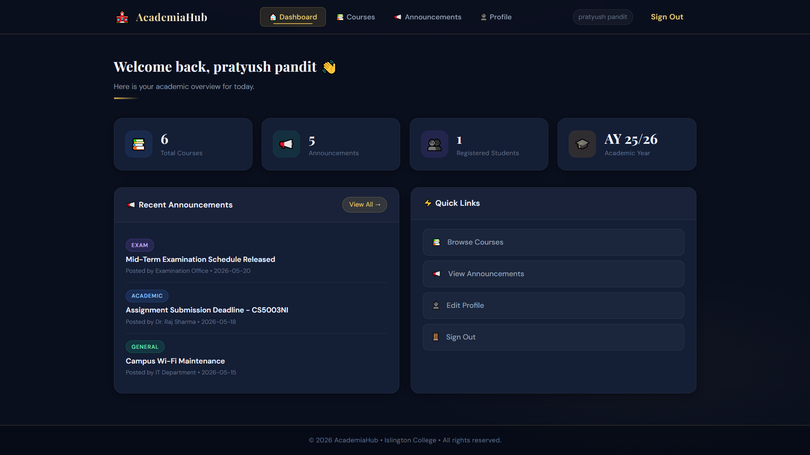
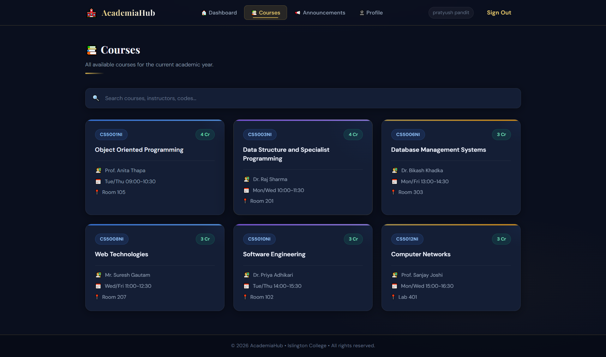
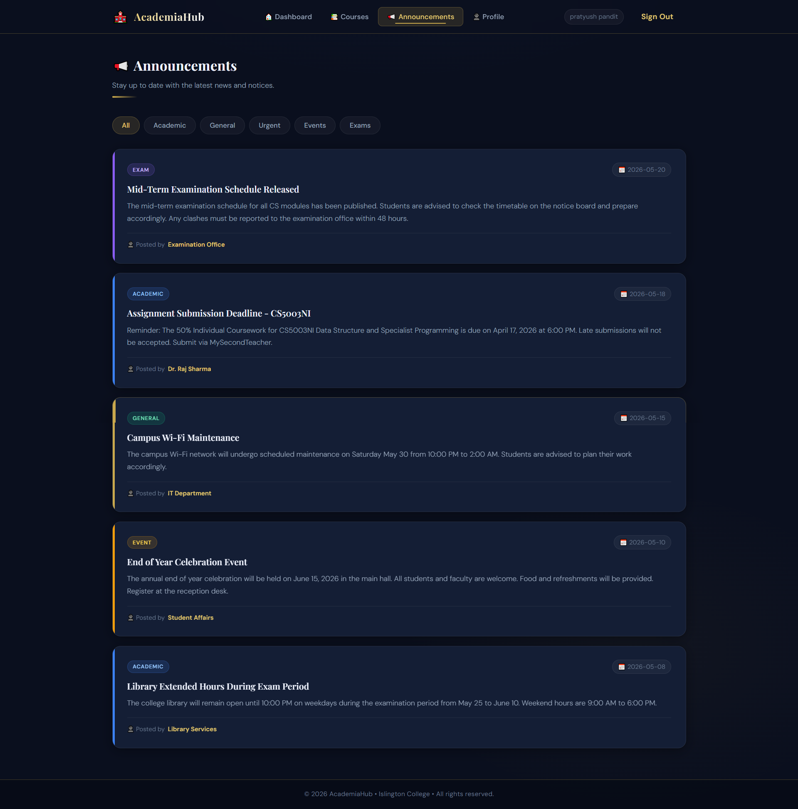
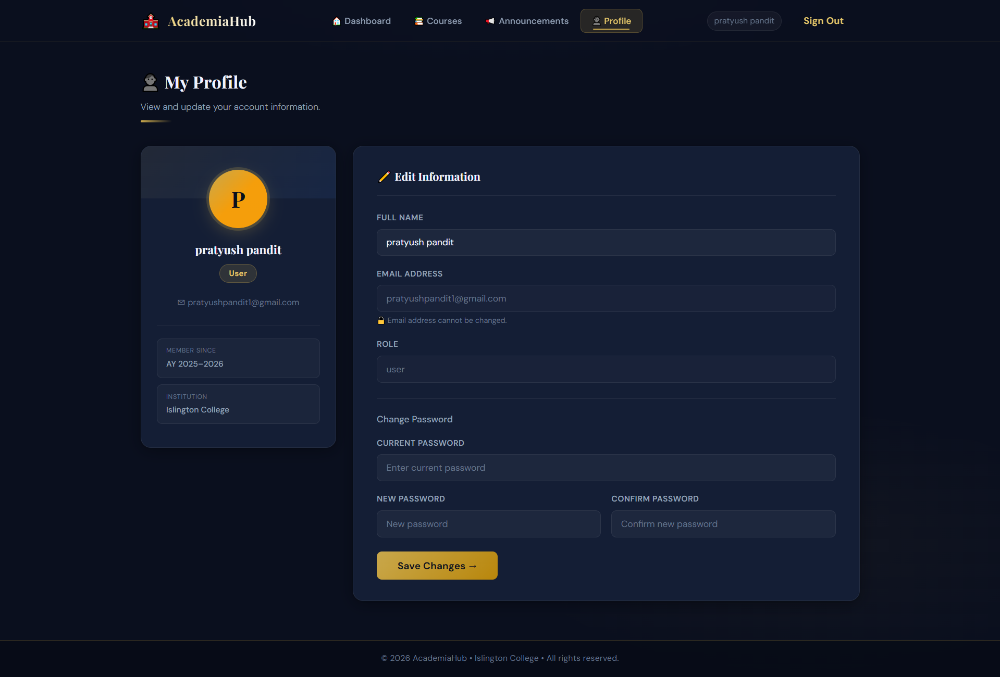

```markdown
# 🎓 AcademiaHub

**AcademiaHub** is a modern **Academic Management System** developed for Islington College using Java JSP, Servlets, and MySQL. It features a beautiful dark UI with gold accents and provides students & faculty with an intuitive platform to manage academic activities.






---

## ✨ Features

- **Dashboard** with live stats and recent announcements
- **Course Catalog** with search functionality
- **Announcements System** with category-based filtering (All, Academic, General, Urgent, Events, Exams)
- **User Authentication** (Login & Registration)
- **Profile Management** with password change
- **Fully Responsive** dark theme design
- **MySQL Database** integration

---

## 🛠️ Tech Stack

- **Backend**: Java 17+, JSP, Servlets
- **Frontend**: HTML5, CSS3, Vanilla JavaScript
- **Database**: MySQL
- **Server**: Apache Tomcat 11
- **IDE**: Eclipse IDE
- **Driver**: MySQL Connector/J 9.7.0

---

## 📁 Project Structure

```bash
AcademiaHub/
├── src/
│   └── main/
│       ├── java/
│       │   └── com/academiahub/
│       │       ├── config/
│       │       ├── controllers/     # Servlets
│       │       ├── model/
│       │       └── service/
│       └── webapp/                  # (or WebContent)
│           ├── css/
│           ├── WEB-INF/
│           │   ├── includes/
│           │   │   ├── head.jsp
│           │   │   └── navbar.jsp
│           │   ├── web.xml
│           │   └── lib/
│           └── pages/               # All JSP files
├── screenshots/                     # UI Previews
├── schema.sql                       # Database Schema
├── README.md
└── .gitignore
```

---

## 🚀 How to Run the Project

### Prerequisites

- **JDK 8 or higher**
- **Apache Tomcat 11** 
- **MySQL Server** (XAMPP / MySQL Workbench recommended)
- **Eclipse IDE for Enterprise Java Developers**

### Step 1: Database Setup

1. Open **phpMyAdmin** or MySQL Workbench
2. Create a new database named `academiahub`
3. Import the `schema.sql` file located in the project root
4. Update your database credentials in `DBConfig.java` (if needed)

### Step 2: Import Project in Eclipse

1. Open Eclipse
2. Go to **File → Import → General → Existing Projects into Workspace**
3. Select the `AcademiaHub` folder
4. Click **Finish**

### Step 3: Configure Tomcat Server

1. Right-click on the project → **Run As** → **Run on Server**
2. Select your Tomcat v11.0 Server
3. Click **Finish**

### Step 4: Access the Application

Open your browser and go to:

**`http://localhost:8080/AcademiaHub/`**

- **Login Page**: `/login`
- **Register**: `/register`
- **Dashboard**: `/home`

---

## 📸 Screenshots

- [Dashboard](screenshots/dashboard.png)
- [Courses](screenshots/courses.png)
- [Announcements](screenshots/announcements.png)
- [Profile](screenshots/profile.png)
- [Login](screenshots/login.png)
- [Register](screenshots/register.png)

---

## 🔧 Configuration Notes

- Database connection settings are in `com.academiahub.config.DBConfig`
- All JSP files are located under `pages/` folder
- Static resources (CSS, images) are served from `WebContent`
- Session-based authentication is implemented

---

## 📄 Database

The database schema is provided in `schema.sql`. Make sure to run it before starting the application.

---

## 🤝 Contributing

Feel free to fork this project and submit pull requests for improvements.

---

## 📌 Credits

**Developed by**: Pratyush Pandit  
**Institution**: Islington College  
**Academic Year**: 2025–2026

---

**Made with ❤️ for Islington College**

```
